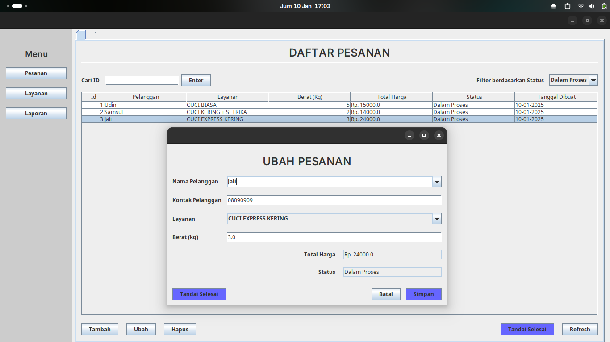
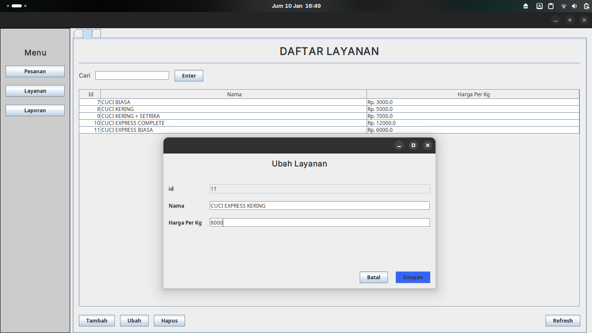
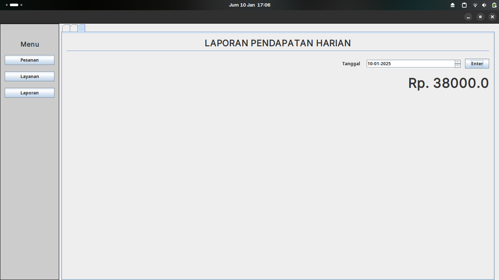

# Simple Laundry Management System

Aplikasi sistem manajemen laundry sederhana yang digunakan untuk mengelola pesanan, layanan, dan laporan keuangan di sebuah bisnis laundry. Aplikasi ini memungkinkan pengguna untuk melakukan pemesanan laundry, memantau status pesanan, mengelola layanan laundry, dan menghasilkan laporan pendapatan berdasarkan tanggal.

## Fitur-fitur

### 1. **Manajemen Pesanan**
   - Pengguna dapat melakukan input data pesanan baru.
   - Pemilihan layanan yang disediakan (misalnya: cuci setrika, cuci saja, setrika saja).
   - Menyimpan informasi pelanggan, layanan yang dipilih, berat cucian, harga, status pesanan, serta tanggal pesanan dibuat.
   - Melihat daftar pesanan dengan berbagai status.
   - Melakukan update status pesanan (misalnya: "Dalam Proses", "Selesai").

### 2. **Manajemen Layanan**
   - Menambah, mengedit, dan menghapus layanan yang tersedia.
   - Setiap layanan memiliki harga per kilogram yang dapat diubah sesuai dengan kebutuhan.

### 3. **Manajemen Pelanggan**
   - Pengguna dapat memasukkan data pelanggan baru saat pemesanan atau menggunakan data pelanggan yang sudah ada.
   - Data pelanggan disimpan dengan informasi nama dan nomor telepon.

### 4. **Laporan Keuangan**
   - Menampilkan laporan pendapatan berdasarkan status pesanan (`Selesai`).
   - Laporan dapat difilter berdasarkan tanggal untuk menampilkan pendapatan dalam rentang waktu tertentu.

### 5. **Pengelolaan Data**
   - CRUD untuk data layanan dan data pesanan.
   - Pengguna dapat menambah, mengedit, atau menghapus data layanan atau pesanan.

## Alur Aplikasi

1. **Input Pesanan**: 
   - Pengguna memilih layanan laundry yang diinginkan, memasukkan informasi pelanggan dan berat cucian, serta mengonfirmasi harga.
   
2. **Proses Layanan**: 
   - Setelah pesanan diterima, status pesanan akan diupdate (misalnya: "Dalam Proses", "Selesai").
   
3. **Pembayaran dan Penyelesaian Pesanan**: 
   - Ketika pesanan selesai, pengguna dapat melakukan pembayaran dan mengupdate status pesanan menjadi "Selesai".

4. **Laporan Pendapatan**: 
   - Pengguna dapat mengakses laporan pendapatan dengan memilih rentang tanggal yang diinginkan untuk melihat total pendapatan dari pesanan yang telah selesai.

## Desain Database

### Tabel: `customers` (Pelanggan)
| Kolom       | Tipe Data    | Deskripsi                     |
|-------------|--------------|-------------------------------|
| `id`        | INT          | ID unik pelanggan (Primary Key)|
| `name`      | VARCHAR(255) | Nama pelanggan                |
| `phone`     | VARCHAR(15)  | Nomor telepon pelanggan       |

### Tabel: `services` (Layanan)
| Kolom          | Tipe Data    | Deskripsi                          |
|----------------|--------------|------------------------------------|
| `id`           | INT          | ID unik layanan (Primary Key)      |
| `name`         | VARCHAR(255) | Nama layanan                       |
| `price_per_kg` | DECIMAL(10,2)| Harga per kilogram layanan        |

### Tabel: `orders` (Pesanan)
| Kolom          | Tipe Data    | Deskripsi                          |
|----------------|--------------|------------------------------------|
| `id`           | INT          | ID unik pesanan (Primary Key)      |
| `customer_id`  | INT          | ID pelanggan (Foreign Key)         |
| `service_id`   | INT          | ID layanan yang dipilih (Foreign Key) |
| `weight_kg`    | DECIMAL(10,2)| Berat cucian dalam kilogram        |
| `total_price`  | DECIMAL(10,2)| Total harga pesanan                |
| `status`       | ENUM         | Status pesanan (e.g., 'Selesai')   |
| `created_at`   | TIMESTAMP    | Tanggal dan waktu pembuatan pesanan|
| `updated_at`   | TIMESTAMP    | Tanggal dan waktu terakhir update status |

### Relasi:
- **orders.customer_id** merujuk ke **customers.id** (Many-to-One)
- **orders.service_id** merujuk ke **services.id** (Many-to-One)

## Screenshot

| Halaman            | Screenshot                                            |
|--------------------|-------------------------------------------------------|
| Daftar Pesanan     |                 |
| Daftar Layanan     |             |
| Laporan Pendapatan |        |

## Teknologi yang Digunakan
- **Java Swing** untuk antarmuka pengguna.
- **MySQL** sebagai basis data.
- **JDBC** untuk koneksi ke database.
- **Maven** untuk manajemen dependensi.

## Instalasi

### Prasyarat
- Pastikan Java Development Kit (JDK) terinstal di komputer Anda.
- Instal MySQL dan buat database baru.

### Langkah Instalasi
1. Clone repository ini ke komputer Anda.
2. Atur konfigurasi koneksi database di file `database.properties` (misalnya, username dan password MySQL).
3. Jalankan aplikasi menggunakan IDE favorit Anda (misalnya, NetBeans, IntelliJ) atau jalankan dari terminal menggunakan perintah:
   ```bash
   java -jar LaundryManagementSystem.jar

